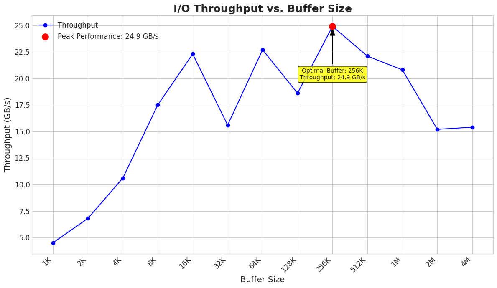
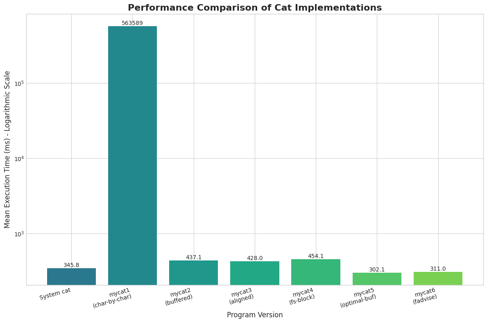

## Meowhw

##### 姓名：田原  学号：2023200406

### mycat3

#### 为什么将缓冲区对齐到系统的内存可能提高性能？你的实验结果支持这个猜想吗？为什么？

将I/O缓冲区对齐到内存页边界可以提高性能，主要有两个原因：

1. 避免内核额外的数据拷贝：当应用程序调用 read 时，内核需要将数据从其内部的页缓存 (Page Cache) 复制到应用程序提供的缓冲区中。内核的页缓存本身就是以内存页（Page）为单位进行组织的，是页对齐的。如果应用程序的缓冲区也是页对齐的，内核就有可能使用更高效的方式来完成数据传输。反之，如果缓冲区没有对齐，它可能会跨越两个内存页，内核就必须执行两次独立的、代价更高的拷贝操作才能填满这个缓冲区，这会消耗更多的CPU周期。
2. 实验结果分析：
   结果支持这个猜想但提升效果并不显著。
   mycat2 (使用普通malloc): 平均耗时 437.1 ms
   mycat3 (使用页对齐的缓冲区): 平均耗时 428.0 ms
   可以看到，性能从437.1ms提升到了428.0ms，有大约2%的改进。
   因为当前的应用场景（标准缓冲I/O）下，内存对齐带来的优势还不是性能的主要决定因素。此时，性能瓶颈更多地在于系统调用的开销以及内核态与用户态之间切换的成本。尽管页对齐减少了内核中的一些拷贝工作，但相比于其他开销，这部分节省的时间占比很小。

#### 为什么我们直接使用`malloc`函数分配的内存不能对齐到内存页，即使我们分配的内存大小已经是内存页大小的整数倍了。

malloc 不保证返回页对齐的地址，原因在于它的设计目标和实现机制：

1. malloc的对齐保证：C语言标准规定，malloc 返回的指针必须为“任何内置数据类型”进行适当地对齐。在现代64位系统上，这通常意味着8字节或16字节对齐，这足以满足 int, double, struct 等类型的存储需求，但远远小于一个内存页的大小（通常是4096字节）。

2. malloc的内部管理和元数据：malloc 是一个通用的内存管理器。为了有效地管理堆内存并处理无数次或大或小的内存请求，它需要在每次分配的内存块旁边存储一些元数据（metadata）。这些元数据通常紧邻在返回给用户的内存地址之前，记录了当前内存块的大小、状态（是否空闲）等信息。

因此，当调用 malloc(4096) 时，malloc 的实现可能会在内部申请一个稍大于4096字节的块，将元数据写在这个块的头部，然后将紧随元数据之后的地址返回。这个返回地址就不是页对齐的了。

#### 你是怎么在不知道原始的malloc返回的指针的情况下正确释放内存的？

**在alloc函数中**

1. 超量申请内存：申请了比所需 size 更大的内存。多出来的 page_size - 1 是为了确保在这块内存中一定能找到一个页对齐的地址，而 sizeof(void*) 则是用来预留存储原始指针的空间。
2. 在计算出对齐地址 aligned_ptr 后，代码将 original_ptr（即 malloc 真正返回的地址）存放在了aligned_ptr 前方一个指针大小的空间里。

**在free函数中**

1. 当 align_free 接收到 aligned_ptr (在函数内叫 ptr) 时，它执行了相反的操作：访问 ptr 前方一个指针大小的内存，将那里的内容当作一个指针取出来。这个取出来的内容，正是我们之前的 original_ptr。
2. align_free 拿到了 malloc 最初返回的那个未对齐的、带有元数据的原始指针，调用 free(original_ptr)完成所有内存正确释放。

### mycat4

#### 为什么在设置缓冲区大小的时候需要考虑到文件系统块的大小的问题？
1. 核心思想是让软件的操作模式与硬件的物理特性相匹配，以实现最高效率。
2. 计算机存储数据到磁盘时，并不是以单个字节为单位，而是以块（Block）为单位进行组织的。最小化I/O操作：当请求读取的数据量是文件系统块大小的整数倍时，文件系统和磁盘控制器可以最高效地执行操作。它们可以直接读取一整个或多个完整的物理块。
3. 如果只请求读取或写入半个块，操作系统和文件系统就可能需要执行一次“读-改-写”操作：它必须先将包含所需数据的整个物理块读入内存，修改其中的一部分，然后再将整个块写回磁盘。这个过程引入了额外的I/O和CPU开销，大大降低了效率。

#### 对于上面提到的两个注意事项你是怎么解决的？

1. 代码没有使用一个全局固定的块大小，而是在 main 函数中打开文件后，将文件描述符 fd 传递给了 io_blocksize(fd) 函数。在该函数内部，它通过 fstat(fd, &st) 系统调用来查询当前打开的这个特定文件的属性。st.st_blksize 字段就包含了该文件所在文件系统的首选I/O块大小。这确保了程序总是能获取并使用针对当前操作文件的正确块大小。
2. 合法性校验： st.st_blksize <= 0 会检查获取到的块大小是否是一个正数。如果 fstat 成功了，但返回了一个无效的块大小（如0或负数），这个条件就会触发。在上述任何一种失败情况下，程序都会放弃使用这个虚假的块大小，并回退到使用一个已知的安全值——系统的内存页大小 page_size。

特别说明：为什么运行时间相较于mycat3反而稍有下降？
猜测：在测试环境中，所使用的 ext4 文件系统的默认块大小（st_blksize）通常就是 4096 字节。而系统的内存页大小（page_size）也恰好是 4096 字节。在这种情况下，lcm(4096, 4096) 的结果仍然是 4096。这意味着 mycat4 最终使用的缓冲区大小和 mycat3 完全一样！缓冲区大小没变，性能就几乎一样。为什么时间还多了呢？因为mycat4 额外执行了一次 fstat 系统调用和一次 gcd/lcm 整数运算的开销。这个开销极小，但确实存在。

### mycat5

寻找性能“拐点”: 脚本遍历了从 1K 到 4M 的一系列缓冲区大小。我们的目标是找到性能曲线的“拐点”或峰值。数据看，性能在 256KB 时达到顶峰（24.9 GB/s）。继续增大缓冲区，性能不再有显著提升，反而因为缓存策略、内存管理开销等更复杂的原因出现了波动和下降。这个 256KB 就是通过实验找到的理想值。

### mycat6

#### 你是如何设置`fadvise`的参数的？

这个函数调用的参数设置如下：

- fd: 这是刚打开的文件的文件描述符，用于告诉内核要对哪个文件提供建议。

- offset = 0: 这个参数建议内核从文件的起始位置（偏移量为0）开始应用这个访问策略。

- len = 0: 这是一个特殊值，它告诉内核这个建议适用于整个文件，从起始偏移量一直到文件末尾。

- advice = POSIX_FADV_SEQUENTIAL: 这是最关键的参数。向内核提供的“建议”是 POSIX_FADV_SEQUENTIAL（顺序访问模式）。

#### 对于顺序读写的情况，文件系统可以如何调整readahead？对于随机读写的情况呢？

对于顺序读写 (Sequential Access):

- 工作模式：当内核检测到（或被 POSIX_FADV_SEQUENTIAL 明确告知）一个进程正在顺序读取文件时，它会做出一个合理的推断：这个进程很可能接下来会读取块3、块4等等。

- 调整策略：基于这个推断，内核会变得非常“积极”。它会启动一个预读窗口，提前将文件后续的多个块读入页缓存。一个常见的策略是自适应调整窗口大小：如果内核发现每次预读的数据都被应用程序很快地消耗掉了，它就会认为自己的预测是正确的，从而加倍扩大预读窗口，直到达到某个上限。这样，当应用程序的 read() 系统调用发生时，数据有很大概率已经存在于内存中，从而避免了昂贵的磁盘等待时间，极大提升了吞吐率。

对于随机读写 (Random Access):

- 工作模式：当一个进程在文件中“跳跃式”地读取数据时（，内核会判定这是随机访问模式。

- 调整策略：在这种情况下，积极的预读不仅没有好处，反而有害。因为它会浪费宝贵的I/O带宽去读取很可能永远不会被用到的数据，并且这些无用的数据还会“污染”页缓存，挤占掉其他更有用的数据。因此，当内核检测到随机读写模式时（或被 POSIX_FADV_RANDOM 明确告知），它会大幅缩小甚至完全禁用readahead机制。它会回到一种“按需读取”的模式，只有当应用程序明确请求某个数据块时，它才会去磁盘读取。

比mycat5慢的原因：猜测：代Linux内核非常先进，它能够自动检测顺序读取模式。对于 cat 这种最典型的顺序读文件场景，内核的启发式算法早就发现，并默认开启了激进的预读策略。posix_fadvise 本身也是一次系统调用。虽然它非常轻量，但终究不是零成本。它需要一次从用户态到内核态的上下文切换。这次测试中多出来的约9毫秒，很可能就是这次“多余”的系统调用开销以及正常的系统测量噪声所导致的。

